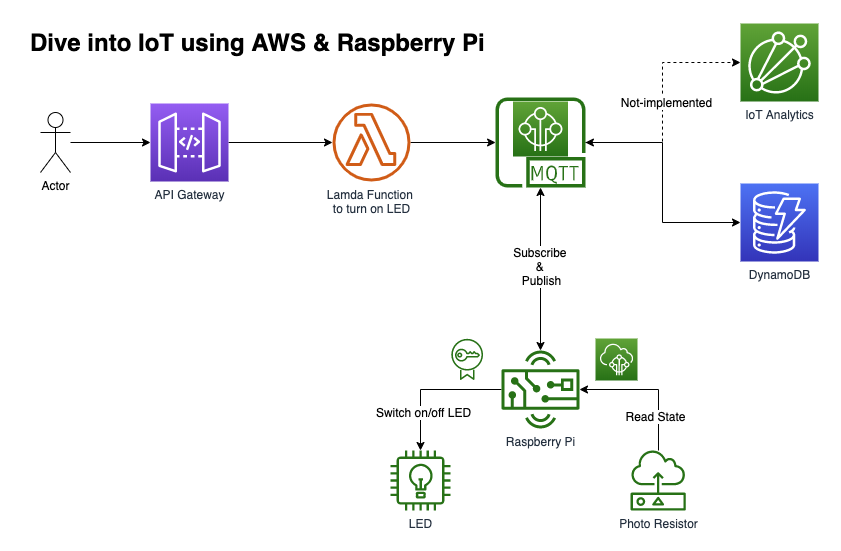

# Dive into IoT using AWS & Raspberry Pi

Welcome to getting started with IoT. This is a simple hands on lab to get you started with AWS IoT on the Raspberry Pi.

> If you have landed on this repository from an email about the hands-on session, then just do [**00 - Prerequisite**](00-prerequisite) section, and keep your Pi ready for the lab. If you want to follow everything on your own, you are more than welcome. Also refer **"[Getting Started with AWS IoT](https://docs.aws.amazon.com/iot/latest/developerguide/iot-gs.html)"** guide.

## Architecture Overview

## What do you need ?
 * [Raspberry Pi](https://raspberrypi.org), with power supply & Class 10 microSD card, [loaded with Rasbian](/00-prerequisite).
 * A valid AWS account with rights to create IAM roles, and needed AWS services
   * IAM roles
   * DynamoDB
   * Lambda functions
   * IoT core
   * API Gateway

> You can always [sign up for a free tier account](https://portal.aws.amazon.com/billing/signup#/start) for this lab

### Additional Hardware ~ provided during the lab

  * [Photo cell](https://www.adafruit.com/product/161)
  * [LEDs](https://www.adafruit.com/product/4202)

### Softwares

We are going to transfer files between the Pi and your local machine. Having these tools in your arsenal helps
 * `ssh` or [putty](https://www.chiark.greenend.org.uk/~sgtatham/putty/latest.html)
 * `scp` or [WinSCP](https://winscp.net/eng/index.php)

## What will we do ?
 * Connect sensors (input)
 * Connect LEDs (output) on the Raspberry Pi
 * Collect data and push to AWS services
 * Push commands to Pi via API Gateway

## How will we do ?
 * **[00 - Prerequisite](/00-prerequisite)**
 * **[01 - Setup IoT Core](/01-iot-core)**
 * **[02 - Setup Hardware](/02-hardware)**
 * **[03 - Build AWS supporting infrastructure](/03-infrastructure)**
 * **[04 - End-to-end connections](/04-end-to-end)**

## Conclusion

By the end of this session, you should have a basic idea on how to setup a raspberry pi with AWS IoT and send/receive messages securely over the internet.

There is a lot more information available, about fleet management, RTOS, Greengrass. **[Check the AWS documentation](https://docs.aws.amazon.com/iot/latest/developerguide/what-is-aws-iot.html)** for more details.
